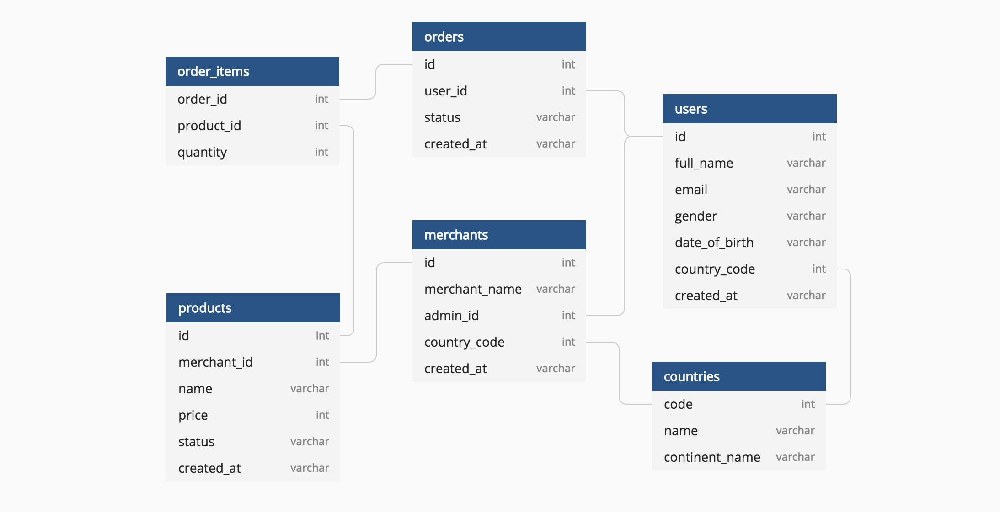

KALIAN BIKIN :

1. database diagram
2. kalian bikin dokumentasi api dan project kalian nya di readme.md

ini database diagram dari challenge avavw :

api di challenge ini :

1. git clone ..
2. npm install
3. buat file .env, copy env variable dari .env.example
4. npm run dev

localhost:8000

- /dashboard/admin/cars = get all cars page
- /dashboard/admin/cars/create (GET) = ini halaman untuk create new car
- /action/cars/create (POST) = ini api action untuk create new car
- - ........................
-
